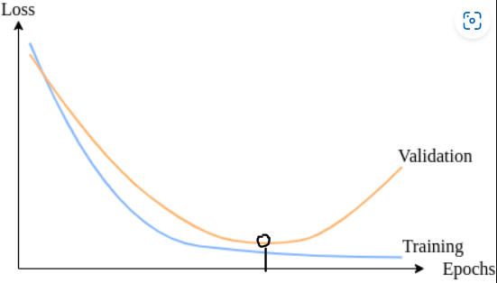
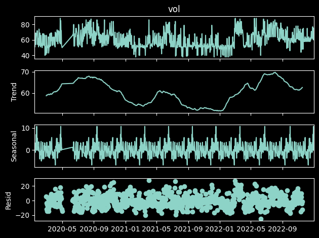
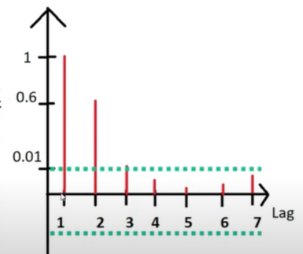
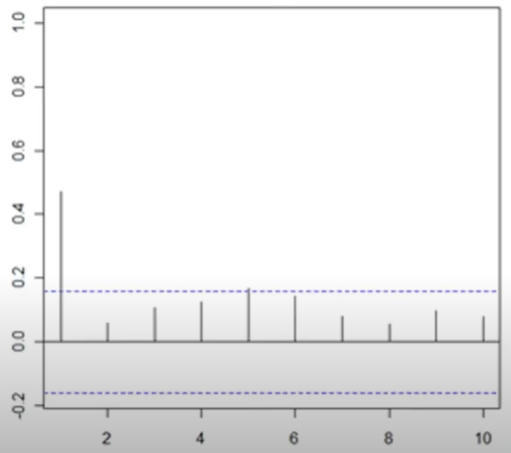
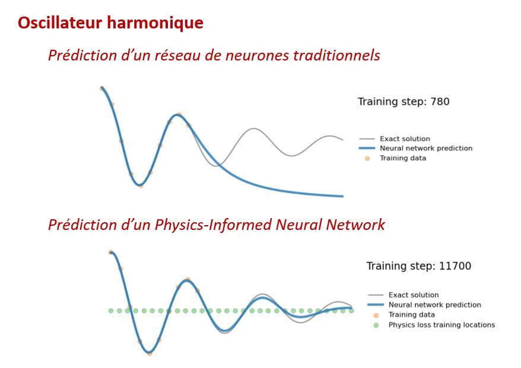
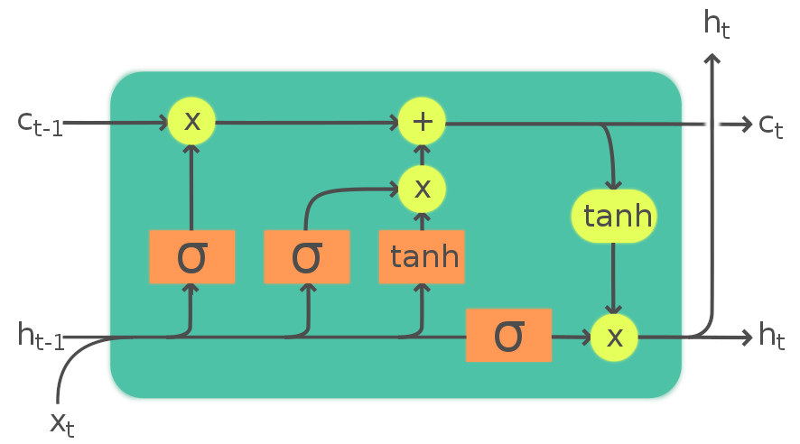
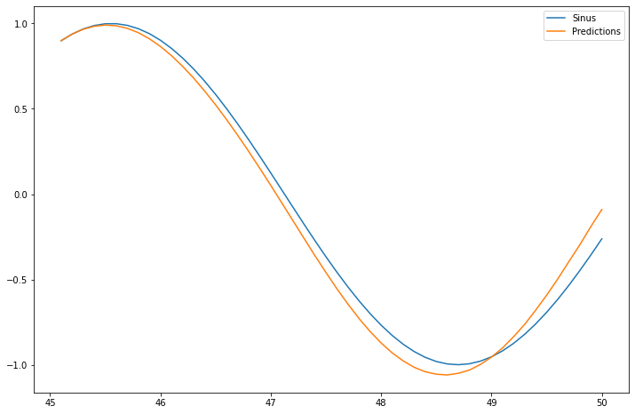
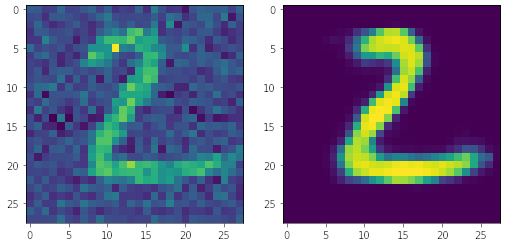
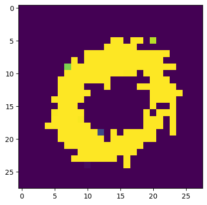

> [Sources](https://www.tfcertification.com/pages/artificial-intelligence)

# Fondamentaux

## Apprentissage par renforcement

> Un agent (l'IA) évolue dans un environnement et apprend de ses actions, en récupérant l'état de l'environnement, des "récompenses" issues de ses actions.

Equivalent à l'apprentissage d'un chien : un ordre est donné (donnée d'entrée), s'il réalise l'action, il est récompensé, sinon il ne l'est pas, voir il est puni. Avec la répétition, le chien va apprendre à quoi correspond l'ordre.

L'intérêt d'un modèle par renforcement c'est l'amélioration. Contre un algorithme préprogrammé, qui lui ne change jamais, une IA peut s'améliorer continuellement.


## Equation de Bellman

On prend en compte :
* $s$ un état
* $a$ une action
* $R$ les récompenses
* $\gamma$ les réductions (discount)
* $V$ la valeur d'un état

$$
V(s) = \max_a (R(s,a) + \gamma V(s'))
$$
> Maximum de toutes les recompenses possibles par action depuis l'état $s$ + la valeur dans un prochain état $s'$. Le coefficient de reduction $\gamma$ permet de modérer l'importance de l'état suivant, plus on est "loin" du but (dont la valeur d'état est maximale) plus la valeur d'état est faible (de l'ordre de $\gamma^n$ pour $n$ le nombre d'étapes pour atteindre le but).

## Le plan : comment une IA prend des décisions

Le plan correspond à un mappage de toute les valeurs d'états (on calcule toutes les valeurs possibles) et définir une "direction" préférentielle en fonction de quel état adjoint maximise la valeur de l'état prochain.

## Processus de décision Markovien (MDP)

On ajoute de l'aléatoire dans le processus de décision ! 

* _Processus de Markov_ : un processus vérifie la __propriété de Markov__ si il y a absence de mémoire. C'est à dire que l'état présent ne dépend pas des états passés. Il y a des probabilités non-nulles que l'agent n'aille pas dans la bonne direction, indépendamment de son état précédent.

* _MDP_ : Extension d'un processus Markovien, auquel on ajoute la prise en compte des actions et des récompenses précédentes. 

L'équation de Bellman devient alors :
$$
V(s) = \max_a \left(R(s,a) + \gamma \sum_{s'} p(s,a,s') \times V(s')\right)
$$
Avec $p(s,a,s')$ = probabilité de se retrouver dans l'état $s'$ en faisant l'action $a$ depuis l'état $s$. On a $\sum_{s'} p(s,a,s') = 1$, l'agent effectuera forcément une action.

## Stratégie VS Plan

Le plan est définie dans le cas déterministe, quand on choisit une action, elle est réalisée sans probabilité.
Dans l'exemple suivant, 2 chemins sont identiques. (:white_check_mark: $R=+1$ et :x: $R=-1$)

| 0.81 :arrow_right: | 0.9 :arrow_right: | 1 :arrow_right: | :white_check_mark: |
|:-:|:-:|:-:|:-:|
| 0.73 :arrow_up: | :black_circle: | 0.9 :arrow_up: | :x: |
| :guardsman: 0.65 :arrow_up: ou :arrow_right: | 0.73 :arrow_right: | 0.81 :arrow_up: | 0.73 :arrow_left: |


La stratégie est pour le cas non déterministe, alors on observe qu'on pénalise beaucoup plus les "chemins" qui ont une probabilité de se rapprocher des actions avec une recompense négative. 
Si on reprend l'exemple, le chemin qui passe prêt de la pénalité :x: est fortement pénalisé.

| 0.71 :arrow_right: | 0.74 :arrow_right: | 0.86 :arrow_right: | :white_check_mark: |
|:-:|:-:|:-:|:-:|
| 0.63 :arrow_up: | :black_circle: | 0.39 :arrow_left: | :x: |
| :guardsman: 0.55 :arrow_up: | 0.46 :arrow_left: | 0.36 :arrow_left: | 0.22 :arrow_down: |

On pourrait implémenter en plus des pénalités de déplacement. C'est-à-dire que chaque état constituerais une pénalité, sauf le but. Alors la prise de décision va être logiquement différente. Alors plus cette pénalité de déplacement va être importante, plus elle va prendre des risques pour arriver au but rapidement.

## Q-Learning

On avait les valeurs $V$ des états, on va maintenant plutôt considérer les qualités d'actions $Q(s_i,a_j)$.
$$
Q(s,a) = R(s,a) + \gamma \sum_{s'} p(s,a,s') \times V(s')
$$
On a donc l'equation de Bellman : $V(s) = \max_a \left(Q(s,a)\right)$ !
$$
Q(s,a) = R(s,a) + \gamma \sum_{s'} p(s,a,s') \times \max_{a'} Q(s',a')
$$

## Différence temporelle

En réalité, la mesure d'une qualité va dépendre de son moment de mesure, car l'agent, en expérimentant différente possibilités, va actualiser les valeur à attribuer à chaque action (mémoire).
Donc $Q_t(s,a) = Q_{t-1}(s,a) + \alpha TD_t(a,s)$ avec $TD$ la différence temporelle qui est juste l'écart entre la valeur d'une action avant et sa nouvelle valeur calculée.
$$
Q_t(s,a) = Q_{t-1}(s,a) + \alpha \left(R(s,a) + \gamma \max_{a'} Q(s',a') - Q_{t-1}(s,a) \right)
$$
La valeur de $\alpha$ va indiquer à quel point l'agent va apprendre. $\alpha = 0$, l'agent ne retient rien des précédents essais, $\alpha = 1$, l'agent écrase toute sa mémoire précédente.

## Overfitting

Un surentraînement apparaît quand le nombre d'itérations (__epochs__) sur le _training dataset_ devient trop grand. C'est pour cela que l'on sépare les données en _training/testing_. Ainsi si un overfitting apparaît en entraînement, au moment du test du modèle on pourra remarquer que l'erreur faite sur les prédictions augmente !
Une bonne approche du nombre d'epochs est de chercher le moment où la courbe d'erreur en test change d'allure (point d'inflexion) :



A l'inverse, le sous entraînement (l'erreur ne s'améliore pas vraiment au cours des epochs) indique que le modèle ne convient pas. Soit il suffit d'augmenter les epochs, ou plus compliqué, rajouter des neurones, augmenter la taille des datasets, ...

Finalement on va chercher à estimer la pertinence de notre modèle. On passe souvent par des [matrices de confusions et leurs mesures associées](https://en.wikipedia.org/wiki/Confusion_matrix#Table_of_confusion) en général, mais pour des problèmes d'analytiques (de régression) les outils mathématiques d'estimation d'erreur seront plus indiqués (erreur moyenne, quadratique moyenne, ou sa racine carré). 
Savoir si un modèle est suffisamment précis / pertinent dépend du contexte, de l'importance et de la gravité d'une mauvaise prédiction...

## Dérive du modèle

A moins qu'un modèle traite des données purement statiques dans un environnement statique, il sera soumis à une dérive. Il s'agit de la perte de précision des résultats de l'IA au cours du temps. Ce phénomène apparait nécessairement car un modèle est entraîné sur des données historiques, passées. Dans le futur de ce _dataset_ de nouvelles tendances pourraient apparaître et le modèle, s'il ne connaît pas la situation, ne saurait s'y adapter.

Alors il faudra ré-entrainer l'agent sur de nouvelles données plus récentes. La fréquence à laquelle on doit ré-entrainer un modèle varie selon :
- les données prises en compte
- le modèle et l'architecture du NN
- et surtout le contexte des données et l'évolution des connaissances sur le sujet

On peut choisir de faire le maintien du modèle __à intervalles régulier__, indépendamment des performances du modèle. Ou basé sur __des indicateurs de performances__, on se base sur des mesures pour évaluer la dérive du modèle et savoir si oui ou non on devrait reprendre l'entraînement.

# Time Series analysis

> Les _time series_ sont des séries de données temporelles (indexées par une frise chronologique, par exemple une température au cours du mois). Leur analyses à pour large but d'établir des prédictions en prenant compte d'un comportement précédent.

Les analyses de séries temporelles regroupent diverses méthodes et modèles types. En Machine Learning, on trouve notamment [les réseaux de neurones récurrents](https://dev.azure.com/SDEA/Data%20Science/_wiki/wikis/Data-Science.wiki/807/Formation-Udemy-IA?anchor=rnn-%3A-r%C3%A9seaux-de-neurones-r%C3%A9currents). Mais ces analyses peuvent être des modèles statistiques.

## Attributs

Un signal est usuellement décomposé en 3 parties :
- Tendance $T$ (moyenne mobile)
- Saisonnalité $S$ (éléments périodique)
- Bruit $R$ (signal résiduel)



La tendance (ou _trend_) indique la stationnarité du signal.
La saisonnalité (ou périodicité) montre l'aspect périodique du signal, selon une période / fréquence donnée.
Le signal résiduel (ou bruit) correspond à tout le reste qui permet de reconstituer le signal au complet.

$$
y(t) = T_t + S_t + R_t
$$

> [Utilisation et interpretation des ACF et PACF](https://www.kaggle.com/code/iamleonie/time-series-interpreting-acf-and-pacf#%F0%9F%9A%80-Cheat-Sheet)

## Modèle d'auto-régression

Une __régression__ permet de modéliser les valeurs continues d'une série selon certains paramètres. Modéliser un nuage de points par une droite est une forme de régression.

Une __auto-régression__ est alors l'utilisation des valeurs précédemment modélisées pour calculer la valeur suivante : on établit une relation de récurrence. L'AR nous permet notamment l'analyse de saisonnalité.

La valeur $y_t$ pour le moment $t$ est définie comme :
$$
y_t = \beta_0 + \sum^p_{i=1} \beta_i \times y_{t-i} + \varepsilon_t
$$
où $\beta_j$ sont les coefficients de la régression, $y_{t-j}$ le moment précédents (d'un certains écart $j$) la mesure $y_t$, $\varepsilon_t$ l'erreur commise entre le modèle est la valeur attendue, et $p$ est l'ordre d'auto-regressions _i.e._ le nombre de valeurs passées à prendre en compte dans le modèle.

L'ordre $p$ se détermine comme étant un nombre de valeurs passées qui influencent effectivement la pertinence du modèle. On vérifie cette influence par la correlation entre une valeur passée et présente :


> Indique que l'ordre à choisir est $p=2$, plus n'a pas d'influence.


## Modèle de moyenne mobile

La MM nous donne notamment l'analyse de tendance.

$$
y_t = \mu + \sum^q_{i=1}\theta_i \times \varepsilon_{t-i} + \varepsilon_t
$$
où $\mu$ est la moyenne globale de la série, $\theta_j$ les coefficients du modèle, $\varepsilon_{t-j}$ les écarts entre la moyenne et la valeur de rang $j$, et $q$ le rang du modèle de moyenne mobile, trouvé par corrélation :


> Indique un rang $q=1$.


## Modèle ARMA
> Auto-regressive mean average model

Un modèle `ARMA(p,q)` est un combinaison d'un modèle autorégressif et de moyenne mobile.

$$
y_t = \mu + \varepsilon_t + \sum^q_{i=1}\theta_i \times \varepsilon_{t-i} + \sum^p_{i=1} \beta_i \times y_{t-i}
$$

Les ordres $q$ et $p$ se trouvent à l'aide des fonctions d'autocorrélation complètes ou partielles respectivement (_cf._ [graphes `ACF` et `PCF`](https://towardsdatascience.com/interpreting-acf-and-pacf-plots-for-time-series-forecasting-af0d6db4061c#:~:text=underlying%20time%20series.-,Autocorrelation%20Function%20(ACF)%20and%20Partial%20Autocorrelation%20Function%20(PACF),ritvikmath)).


## Modèle ARIMA
> Auto-regressive integrated mean average model

Le modèle `ARIMA(p,d,q)` est une amélioration du ARMA en intégrant une opération de différentiation jusqu'à un certains ordre $d$. Permettant ainsi d'analyser des évolutions non-stationnaires (lorsque la tendance globale du signal n'est pas horizontale).

L'ARIMA est définit comme :
$$
Y_t - \sum^p_{i=1} \beta_{i} Y_{t-i} = \varepsilon_t + \sum^q_{i=1} \theta_i \varepsilon_{t-i}
$$

> `ARIMA(0,1,1)` est un [lissage exponentiel](https://en.wikipedia.org/wiki/Exponential_smoothing) : permet de lisser les valeurs les plus anciennes pour leur donner moins d'importance. 

L'intérêt d'un ARIMA se montre particulièrement lorsque :
- la tendance est "bien dessinée" (_i.e._ c'est une courbe identifiable, $\log$, $\exp$, droites, ...
- le signal résiduel est faible
- le signal **ne présente pas de saisonnalité** notable

## Modèle SARIMAX

> Seasonal auto-regressive integrated mean average with eXogenous regressors model

Le modèle SARIMA intègre les éléments de saisonnalité à ARIMA (ne nécessite pas l'hypothèse de stationnarité). Dans sa version SARIMAX, on s'autorise à ajouter d'autres paramètres extérieurs, en dehors de la Time-Series initiale. 

Avec SARIMAX on peut donc complètement analyser un signal avec peut de bruit, dans le temps. 

$$
\phi_p(L) \times \tilde{\phi}_P(L^s) \times \Delta^d \Delta^D_s y_t = A(t) + \theta_q(L) \times \tilde{\theta}_Q(L^s) \times \varepsilon_t
$$
où $(P,D,Q)_s \leftrightarrow (p,d,q)$ respectivement sur une saison et globalement :
- $\phi_p(L)$ AR non-saisonnier.
- $\tilde{\phi}_P(L^s)$ AR saisonnier.
- $\Delta^d \Delta^D_s y_t$ est la série temporelle, différenciée $d$ fois dans le temps et $D$ fois selon le nombre de "saison".
- $A(t)$ est le polynôme de tendance.
- $\theta_q(L)$ MA non-saisonnière.
- $\tilde{\theta}_Q(L^s)$ MA saisonnière.

> En python, la librairie `statsmodels` amène les différents modèles qui aboutissent au [SARIMAX](https://www.statsmodels.org/stable/examples/notebooks/generated/statespace_sarimax_internet.html).

```py
import pandas as pd
from statsmodels.tsa.seasonal import seasonal_decompose
from statsmodels.graphics.tsaplots import plot_acf, plot_pacf
from statsmodels.tsa.stattools import adfuller
from statsmodels.tsa.statespace.sarimax import SARIMAX

df = pd.read_csv('observed.csv')
adf = adfuller(df) # donne diverses valeurs statistiques
pvalue = adf[1] # si pvalue < 0.05, alors la series est stationnaire
lag = adf[2] # periode utilisee

# On peut obtenir les bons params pour p,d,q avec :
from pmdarima.arima import auto_arima
auto_arima(releves.loc[fm_id, 'vol'])
# > ARIMA(1,1,1), nous indique que pour inspecter
# il faudra realiser une differentiation d'ordre d=1
observed_diff = (observed.shift() - observed).dropna()

# Inspecter les auto-correlations :
sd = seasonal_decompose(observed_diff, period=lag)
sdp = sd.plot()
# Verifier les params trouves par auto_arima
fig, [ax1, ax2] = plt.subplots(nrows=1, ncols=2, figsize=(12,4))
plot_pacf(sd.observed, ax=ax1), plot_acf(sd.observed, ax=ax2)
# Les params saisonniers
fig, [ax1, ax2] = plt.subplots(nrows=1, ncols=2, figsize=(12,4))
plot_pacf(sd.seasonal, ax=ax1), plot_acf(sd.seasonal, ax=ax2)

# modele SARIMAX
p, d, q, P, D, Q, s = 1, 1, 1, 2, 0, 1, lag 
# P,Q trouves par les precedentes correlations
# D utile selon la forme des precedentes correlations
model = SARIMAX(endog=observed, order=(p,d,q), seasonal_order=(P,D,Q,s))
# on peut ajouter une series exog en params, pour du multivarie
results = model.fit()

# Le graphe suivant doit ne presenter aucune correlations
residuals = results.resid
fig, [ax1, ax2] = plt.subplots(nrows=1, ncols=2, figsize=(12,4))
plot_pacf(residuals, ax=ax1), plot_acf(residuals, ax=ax2)

# Prediction dans le futur
forecast_steps = 60
forecast = results.get_forecast(steps=forecast_steps)
# visualisation de ces predictions
pred_timestamps = pd.date_range(
    start=releves.loc[fm_id, 'vol'].index[-1],
    periods=forecast_steps+1, 
    freq='D')
pd.concat([
    pd.DataFrame(releves.loc[fm_id, 'vol'][-100:].values, index=releves.loc[fm_id, 'vol'][-100:].index, columns=['volume']), 
    pd.DataFrame(forecast.predicted_mean.values, index=pred_timestamps[1:], columns=['predicted'])    
], axis=0).plot(figsize=(12,6), title=f'Predictions sur {forecast_steps} jours')
```

## Processus de création

La marche a suivre usuelle qui amène à la production d'un de ces précédents modèles est comme suit :
- **Stationnarisation** : éventuellement, si la moyenne mobile (pour _dé-saisonnaliser_) présente une tendance non-stationnaire on se basera plutôt sur une série différenciée $d$ fois.

- **Identification a priori de modèles potentiels**, on suppose certaines périodicité probables (mensuelles, saisonnière, annuel,  quotidienne, ...), besoins ARMA, ARIMA, ... 

- **Estimation des modèles potentiels**, choix des paramètres pour chacun des modèles à tester (les ordre $p,d,q,P,D,Q,s$). Minimiser des critères d'informations (voir [AIC](https://fr.wikipedia.org/wiki/Crit%C3%A8re_d%27information_d%27Akaike) par exemple) peut permettre de déterminer les ordres. Ou encore les diagrammes d'auto-correlations (ACF et PACF).

- **Vérification des modèles potentiels**, on teste ces modèles, on vérifie que le signal résiduel n'est bien qu'un *bruit blanc* (pas d'auto-correlation dans les résidus).

- **Choix définitif d'un modèle**, on garde le meilleur. Des critères d'information basés sur l'information de Kullback, par exemple, les critères d'Akaike (AIC) et de Schwartz (BIC), erreurs statistiques, ...

- **Prévision à l'aide du modèle choisi**, on peut utiliser le modèle.

- **Analyse a posteriori de la prévision**, après un laps de temps, on vérifie qu'effectivement les prédictions n'étaient pas trop éloignées de la réalité.

# Deep Learning

## ANN : Artificial Neural Network

### Perceptron

En 1936, Alan Mathison Turing envisage déjà la possibilité d'un apprentissage par la machine :

> Les machines non-ordonnées ont une configuration telle que, une fois cette configuration établie et si elle est restreinte correctement pour interférer avec elle-même, la machine se comporte comme une machine organisée vers un certain but. 
*- Théorie des nombres calculables, suivie d’une application au problème de la décision -*

En 1943, [W. McCulloch et W. Pitts](https://www.bibsonomy.org/bibtex/13e8e0d06f376f3eb95af89d5a2f15957/schaul) théorisent le __Perceptron__, qui sera mis en application en 1958 par Frank Rosenblatt. Le principe d'un Perceptron est de copier en substance un neurone humain: des données (impulsion électriques) en entrée qui sont transformées par le passage dans le corps du neurone (axone) et dirigées vers le prochain neurone.

Alors construire un réseau de neurones artificiels serait simplement une successions de couches de Perceptrons ou __neurone artificiel__ !

### Neurone artificiel

::: mermaid
graph LR;
N((Neurone - A o Σ))
N1(Neurone d'entrée 1)
N2(Neurone d'entrée 2)
N3(Neurone d'entrée 3)
N4(Neurone de sortie)
N --y--> N4
N1 & N2 & N3 --"xi * wi"--> N
:::

> Les valeurs reçues et générées par un neurones doivent être sur une même échelle : _centrer_ (moyenne = 0) et _réduire_ (écart-type = 1).

### Fonction d'activation

Une fonction d'activation permet de classifier les résultats de calcul d'un neurone. Les plus utilisés sont:
* Fonction de seuil (Heaviside) 
$$
\forall x > a, H_a(x) = 1, \forall x < a, H_a(x) = 0
$$ 

* Sigmoïde 
$$
S(x) = \frac{1}{1+e^{-x}}
$$

* Redresseur 
$$
\phi(x) = \max(0,x)
$$

* Tangente hyperbolique 
$$
th(x) = \frac{1-e^{-2x}}{1+e^{-2x}}
$$

Souvent on utilisera le redresseur d'abord, pour augmenter l'influence des valeurs largement plus élevées que 0. Puis une sigmoïde pour séparer entre 0 et 1 (de manière continue / probabiliste, contrairement à Heaviside).

### Intérêt des couches cachées

Chaque neurone va adapter les poids $w_i$ de chaque variable d'entrée. Eventuellement, ils se spécialisent ($w_i = 0$ sur certaines variables), il ne considérera que certains éléments de l'analyse. Alors, la multiplication des neurones permet d'étudier des cas particuliers par neurone, puis de les assembler pour un meilleur résultat !

### Apprendre de ses erreurs

On notera les valeurs prédites par un neurone $\hat y$ et $y$ seront les vraies valeurs observées / empiriques.
Pour permettre l'apprentissage des neurones, on utilisera l'écart $\hat y - y$ pour corriger les poids $w_i$ du neurone. On notera le coût $C = \frac{1}{2} (\hat y - y)^2$, que l'on va _rétropropager_ sur les poids du neurone (selon un certain algorithme).

_N.B._ : Si on veut le coût sur l'ensemble de l'ANN (de $n$ neurones), on a :
$$
C = \frac{1}{2n} \sum_{n} (\hat y - y)^2
$$

* **Algorithme du Gradient** :

Un gradient (noté $\vec \nabla$) est définit comme l'ensemble des dérivées partielles d'une fonction (ou autre). Comme une dérivée représente la tangente, c'est-à-dire la direction d'une courbe. Alors, en utilisant ce gradient sur le coût $C$ de notre valeur trouvée par le neurone, on cherche la "direction" qui nous amène vers le minimum de coût (le moins d'écart entre la valeur prédite et la valeur attendue).
> Il faut que la fonction $C$ soit **convexe**, sinon il risque d'y avoir un problème de minimum local mais pas global.

* **Algorithme du Gradient stochastique** :

Pour éviter l'hypothèse de convexité du coût, on va rétropropager le coût à chaque itération, plutôt que par lot (= sur toutes les "lignes" de données d'entraînement). On peut en plus ajouter un paramètre aléatoire sur le choix de la ligne à traiter, laissant la possibilité de traiter une même ligne plusieurs fois (mais comme les poids changent ce n'est pas un problème).
> Il y a aussi une version entre-deux, par mini-lots, ou l'on choisit des sous populations de données.

En Python, la rétropropagation du gradient (et son calcul) donne :
```python
def _update_parameters(self, derror_dbias, derror_dweights):
    # mise a jour du modèle à partir du cout / erreur
    self.bias = self.bias - (derror_dbias * self.learning_rate)
    self.weights = self.weights - (derror_dweights * self.learning_rate)

def _compute_gradients(self, input_vector, target):
    # calcul du gradient = les erreurs de prediction face aux cibles
    # d'abord faire la prediction du modele actuel
    layer_1 = np.dot(input_vector, self.weights) + self.bias
    layer_2 = self._sigmoid(layer_1)
    prediction = layer_2
    
    # puis calcul des erreurs faites
    derror_dprediction = 2 * (prediction - target)
    dprediction_dlayer1 = self._sigmoid_deriv(layer_1) # derivée de la Sigmoide
    dlayer1_dbias = 1
    dlayer1_dweights = (0 * self.weights) + (1 * input_vector)

    # regle de derivation partielle en chaine
    derror_dbias = (derror_dprediction * dprediction_dlayer1 * dlayer1_dbias)
    derror_dweights = (derror_dprediction * dprediction_dlayer1 * dlayer1_dweights)
    
    # retourne les dérivées partielles de la fonction d'erreur = coût 
    # par rapport aux biais et aux poids
    return derror_dbias, derror_dweights

def train(self, input_vectors, targets, iterations):
    # entrainement du modèle, utilisation de la retropropagation
    for current_iteration in range(iterations):
        # choix aleatoire d'un vecteur d'entree et sa cible
        random_data_index = np.random.randint(len(input_vectors))

        input_vector = input_vectors[random_data_index]
        target = targets[random_data_index]

        # calcul du gradient
        derror_dbias, derror_dweights = self._compute_gradients(input_vector, target)

        self._update_parameters(derror_dbias, derror_dweights)
```

En pratique on ne fait qu'appeler des méthodes incluses dans des librairies, _cf._ [annexes Keras](https://dev.azure.com/SDEA/Data%20Science/_wiki/wikis/Data-Science.wiki/807/Formation-Udemy-IA?anchor=utilisation-de-keras).

### Entraînement

On va donc pouvoir compiler ces techniques :

1. Initialiser les poids proche de 0, mais non nuls, pour minimiser leur coût. C'est l'algorithme qui va choisir d'amplifier l'importance d'une variable par la suite.

2. Propagation avant. Le neurone fait son calcul.

3. Estimer l'erreur, on en tire le coût $C$.

4. [Propagation arrière](http://neuralnetworksanddeeplearning.com/chap2.html), avec l'algorithme du gradient. C'est ici qu'intervient le __learning rate__, une valeur qui correspond à l'espacement entre 2 corrections des poids de l'IA. S'il est trop grand on risque de ne jamais converger et trouver le minimum de coût, s'il est trop faible on apprend très lentement. Il est possible d'avoir un LR adaptatif qui diminue lorsque la fonction de coût diminue.

5. Répéter les étapes 2-4. Après chaque _observation_ = apprentissage renforcé, ou après un _lot d'observations_ = apprentissage par lot, sur l'ensemble du training set. 

6. Les étapes précédentes constituent une __époque__. Faire plusieurs époques sur les données d'entraînement.

### Sizing du réseau de neurones

Utiliser trop de couches et de neurones, trop d'epochs, entraîne un _overfitting_ (ou à l'inverse un _underfitting_).

Avec Keras, dans Python, pour comparer les pertes sur l'entrainement et les tests, on peut utiliser :
```python
model.fit(x=X_train, y=y_train, validation_data=(X_test, y_test), batch_size=128, epochs=400)
# validation_data va permettre la comparaison entre les performance d'entrainement et de test
# batch_size est usuellement une puissance de 2
losses = pd.DataFrame(model.history.history)
losses.plot()
```
Tant que ces deux courbes sont proches, il n'y rien à changer !

Pour plus de détails sur les opérations à faire par la suite pour évaluer notre modèle, voir le [lien vers le Notebook](https://colab.research.google.com/drive/1p7x9Ro6ut8RcLzjF4yWEcolviQaf2_aT#scrollTo=cHClZNq-Omxn).

En pratique on ajoute une couche _Dropout_ (désactivation aléatoire pour une epoch de neurones de la couche précédente avec un probabilité usuellement dans $[0.2 ; 0.5]$) ou un callback _EarlyStop_ (qui va stopper l'apprentissage en cas de détection d'un overfitting). [Voir l'exemple](https://colab.research.google.com/drive/1w67eoqi2MniYGMfo6Dpy-79XYZtaBaXW#scrollTo=-IJz7W2oW9vF), à partir d'un [modèle surentrainé](https://colab.research.google.com/drive/1w67eoqi2MniYGMfo6Dpy-79XYZtaBaXW#scrollTo=HmGuxwCSWpLk&line=1&uniqifier=1).

En "lâchant" (désactivant) cette proportion de neurones à chaque epoch, on favorise le comportement statistique du NN (généralisation et pas un "enregistrement" du cas particulier en entrée). Les neurones vont devoir compenser plus fortement les erreurs et manques d'information individuelles des autres. Donc du point de vue macro, le réseau est plus performant. Chaque unité est plus capable, le réseau n'en est que meilleur ! ([source](https://towardsdatascience.com/dropout-in-neural-networks-47a162d621d9))

> Voir le [_playground_ de Tensorflow](https://playground.tensorflow.org/).

## [PINN](https://maziarraissi.github.io/PINNs/) : Physics Informed Neural Network

Comme leur nom l'indique, il s'agit d'indiquer à un NN la physique à modéliser. Ce type de réseau de neurones permet de réaliser des résolutions d'équations, trop complexes pour des algorithmes simples ou encore une résolution analytique.

> Voir une [vidéo d'introduction](https://www.youtube.com/watch?v=kDlrOanVtf8).

Le NN en lui même est identique. Ce que l'on change c'est la façon de calculer la fonction de pertes. On lui inclut les contraintes physiques tirées de l'équation que l'on cherche à résoudre. Cette fonction de perte (ou de coûts) devient $C = C_f + C_p$ où les coûts tirés de la physique $C_p$ prendront en compte :
- PDE : _partial differential equation_, l'équation en question
- BC : _boundaries conditions_, les restrictions de bords (comme une restriction à un certain espace)
- IC : _initial condition_, la condition initiale, correspondant à l'état initial du système à modéliser.

> [Vidéo d'application](https://www.youtube.com/watch?v=ISp-hq6AH3Q) à la résolution de l'équation de Navier-Stokes (mécanique des fluides) avec exemples de codes (PyTorch, python).

Leur avantage face à un NN classique, est que si un ANN peut faire de bonnes prédictions sur des données qui ont le même contexte que ses données d'entraînements, un PINN pourra sortir de ce contexte et s'y adapter un peu mieux :



En pratique, avec _TensorFlow_ :
Sur l'exemple de l'équations de Burger
$$
\frac{\partial u}{\partial t} + u \times \frac{\partial u}{\partial x} - \frac{0.01}{\pi} \frac{\partial^2 u}{\partial x ^2}
$$
avec les conditions $u(0,x) = -\sin(\pi x)$ et $u(t,-1) = u(t,1) = 0$.

Cette fonction $u(x,t)$ est celle que l'on cherche à modéliser par le PINN :

```python
def u(t, x):
    u = neural_net(tf.concat([t,x],1), weights, biases)
    return u
def f(t, x):
    u = u(t, x)
    u_t = tf.gradients(u, t)[0]
    u_x = tf.gradients(u, x)[0]
    u_xx = tf.gradients(u_x, x)[0]
    f = u_t + u*u_x - (0.01/tf.pi)*u_xx
    return f
```
Alors la fonction de perte, prise en erreur quadratique moyenne (_MSE_) devient : $MSE = MSE_u + MSE_f$ c'est à dire la MSE du réseau de neurone (comme sur un ANN, dont la fonction de coût serait la MSE), à laquelle on ajoute les pertes tirées de l'équation physique.
$$
MSE = \frac{1}{N_u} \sum_{i=1}^{N_u} |u(t_u^i, x_u^i) - u^i|^2 + \frac{1}{N_f} \sum_{i=1}^{N_f} |f(t_f^i,x_f^i)|^2 
$$

> Pour modifier la fonction de perte _loss_ utilisée par Keras : https://keras.io/api/metrics/#creating-custom-metrics
Il suffit que la fonction aies une signature `fnc(y_true, y_pred)`. Elle peut alors être utilisée en métrique de contrôle ou même en fonction de perte lors de l'entrainement.

### Liens supplémentaires

- [Google Colab](https://colab.research.google.com/github/janblechschmidt/PDEsByNNs/blob/main/PINN_Solver.ipynb#scrollTo=pQhmdtsqZEkj) pour un exemple d'application.
- [Article ArXiv](https://arxiv.org/pdf/1711.10566.pdf) sur le sujet.
- [GitHub](https://github.com/maziarraissi/PINNs/blob/master/main/continuous_time_identification%20(Navier-Stokes)/NavierStokes.py) d'exemples.
- Autre [GitHub](https://github.com/ShotaDeguchi/PINN_TF2) d'exemples.
- [Video : Résoudre une équation différentielle avec du ML](https://www.youtube.com/watch?v=p9p2YAjIgUU)

## CNN : Convolutional Neural Network


Le cerveau repère des _features_ dans l'environnement et les interprètes en __convolutions__, des formes faciles et rapides à interpréter. Lorsqu'on a du mal à reconnaître un objet, qu'on a l'impression de voir quelque chose qui n'est pas là, c'est un problème d'interprétation de convolutions.

Le but d'un CCN va donc être de reconnaître des features en entrées (son, image, ...) et de les interpréter, en 4 étapes (qui peuvent être multipliées et alternées, avant les couches CC) : _convolution_, _max pooling_, _flattening_, _couche connectée_.

### Convolution

Convolution de fonction, comment une fonction change la "forme" d'une autre :
$$
(f \otimes g)(t) = \int_{-\infty}^{+\infty} f(\tau) g((t-\tau) d\tau
$$

En pratique on va utiliser un _feature detector_ (ou kernel ou filtre, en général une matrice 3x3) que l'on va appliquer à une matrice (qui représente une image par exemple). On va alors effectuer un produit matriciel sur chaque sous-matrice (de la taille du filtre), en se déplaçant d'un _stride_ (pas de glissement du filtre = nombre de pixels sur lesquels se déplacer antre un produit et le suivant). 
On obtient la _feature map_, contenant la valeur de la somme de chaque produit de convolution. L'ensemble des feature maps obtenues à partir de différents filtres est appelée _convolutional layer_.


> Certains filtres vont avoir des effets notables, comme augmenter/diminuer la netteté, garder que les bords des formes, ciselage, ... 

Dans un CNN, le réseau de neurone va chercher lui-même les features detector dont il a besoin ! 

Le but des couches de convolutions est avant tout de diminuer la quantité de données à ingérer par le modèle. On pourrait faire analyser chaque pixel des images du _dataset_ par un ANN, mais alors l'entraînement serait trop long. De plus il serait trop adapté aux images du training set, notamment la position des éléments.

### Max pooling

On extrapole une matrice de données (une image) par le max  des valeurs de petites sous-matrices (en général 2x2). On obtient la _pooled feature map_. Cela correspond à déformer l'image, sans perdre l'information principale.
En supprimant l'information qui n'est "pas importante", on limite aussi le risque d'_overfitting_ du modèle.

> D'autre pooling existent comme min pooling, sub sampling (addition des valeurs dans les sous_matrices).

[Exemple sur la reconnaissance de chiffre](http://scs.ryerson.ca/~aharley/vis/conv/flat.html)

### Flattening

On met simplement les pooled feature map sous forme d'une colonne / vecteur, pour pouvoir l'envoyer par la suite dans d'autres couches du CNN.

### Couche complètement connectée

Les flattened feature map vont être la donnée d'entrée d'un nouveau réseau, dont chaque neurone est connecté à TOUS les suivants. Dans cette nouvelle couche, on va rétropropager les erreurs faites avec l'__entropie croisée__ en fonction de coût et la fonction d'activation _Softmax_.

* Softmax :
$$
f_j(z) = \frac{e^{z_j}}{\sum_k e^{z_k}}
$$

* Entropie croisée :
$$
L_i = - \log \left(\frac{e^{f_{y_i}}}{\sum_j e^{f_j}} \right)
$$ 
ou l'enthalpie croisée :
$$
H(p,q) = - \sum_x p(x) \log q(x)
$$ 
(avec $p$ les valeurs connues, $q$ les valeurs du CNN et $x$ les différentes classes possibles en résultat).

En résumé :
::: mermaid
 flowchart TB;
 I[Image originale]
 F[[Feature maps]]
 P[[Pooled feature maps]]
 V[[Vectors of features]]
 I --"filtrage"--> F
 F --"max pooling"--> P
 P --"flattening"--> V
 V -.- x1 & x2 & x3

 subgraph CEC
 x1 & x2 & x3 --- v01 & v02 & v03 & v04
 v01 & v02 & v03 & v04 --- v11 & v12 & v13 & v14 & v15
 v11 & v12 & v13 & v14 & v15 --- y1 & y2
 end
 y1 & y2 --> Prediction
:::

> Ici, on a deux classes $y_1$ et $y_2$ en sortie. Si on veut pouvoir classer nos résultats en plus de catégories (une image classées selon ses couleurs par exemple) il suffit de multiplier les neurones de classification en sortie.

### Avec Keras

Exemple du _dataset_ MNIST pour la reconnaissance des chiffres dans une image (simple).

## RNN : Réseaux de neurones récurrents

Ce type d'architecture permet de traiter des données en séquences. Les ANN peuvent classifier, évaluer des données fixes. Les données qui se suivent, s'étalent dans le temps seront encore mieux traités dans un RNN.

On vise à traiter des données en séquences temporelles, des phrases, de l'audio, une trajectoire, ... Si on mélange des unités de données dans ces séquences, leur résultat / signification n'est pas le même. 

On va donc réinjecter les résultats de prédictions _outputs_ en _inputs_, ce qui lui donne sont aspect récurrent. Un neurone récurrent ne fait pas que donner un _output_ mais aussi utilise son résultat pour s'auto-alimenter. On va créer des couches de ces neurones récurrents pour créer un RNN.

Néanmoins dans cet architecture basique, on ne garde pas en mémoire plus que l'étape précédente. Et il serait encore plus intéressant de pouvoir se souvenir d'un historique plus important encore, se souvenir du contexte d'une discussion, par exemple.

### Disparition et explosion du gradient

Lors de la propagation du gradient en arrière (_backpropagation_) on rencontre ces problèmes :

- les premières couches étant souvent les plus petites, leurs coefficients seront moins modifiés, le modèle ne s'actualise pas assez à ce niveau = _vanishing gradient_.

- à l'inverse, lorsque le nombre de neurones et de couches est trop important pour un problème donné, cela multiplie les coefficients à mettre à jour lors de la _backpropagation_ et le NN ne sait plus s'améliorer = _exploding gradient_.

Ces problèmes remarquables sont dû à la "forme" des fonctions d'activations. Elles présentent de faibles variations en leurs bords. 

Afin d'atténuer ces soucis, on peut 

- choisir une normalisation par batch plutôt que sur tout le _dataset_
- changer l'initialisation des poids, avant l'entraînement -> initialisation de Xavier Glorot
- appliquer un _gradient clipping_, couper l'effet du gradient avant qu'il n'atteigne une limite définie à l'avance (il pourrait être restreint à $]-1;1[$ par exemple.

### LSTM et GRU

> LSTM = Long Short Term Memory
GRU = Gated Recurrent Unit

On veut pouvoir faire des prédictions long terme. Pour minimiser les effets néfastes sur les prédictions des _exploding / vanishing gradients_ il suffit de prendre un séquence courte de données (sur 3 jours au lieu de 25 par exemple). Néanmoins, la pédiction ne sera pertinente que sur cette même échelle de temps. Pour cela on met en place une mémoire au long terme !

Un neurone récurrent :
:::mermaid
flowchart LR;
  NR((Neurone))
  Ht[Output t]
  Ht1[Output t-1]
  Xt[Input t]
  Xt --"X(t)"--> NR
  Ht1 --"H(t-1)"--> NR
  NR --"H(t)"--> Ht
  Ht1 <-.- Ht
:::
Où $H_t = \tanh(W(H_{t-1}, X_t)+b)$.

Pour un LSTM, on ajoute en plus des mémoire à long et court terme qui constituerons $H_{t-1}$. Dans ce neurone, il y aura des portes qui laissent éventuellement passer une information :
- Porte d'oubli = ce qui n'est pas accepté
- Porte d'entrée = ce qu'il faut accepter
- Prote de sortie = le résultat sortant
- Porte de mise à jour = fait la mise à jour avec ce qui a été accepté

Mis en équation, un LSTM donne = $x_t + h_{t-1} + c_{t-1} = h_t + c_t$ :



Un GRU est une version simplifiée d'un LSTM. Il existe de nombreuses variations de ce modèle.

### Exemple simple

On veut prévoir l'évolution d'une sinusoïdale. Voir le [notebook original](https://colab.research.google.com/drive/1TYjJ3NyuHAyqa3Zn8xUp5d7RZ_KW8O5f?usp=sharing).
```python
import pandas as pd
import numpy as np
import matplotlib.pyplot as plt

# Les données
x = np.linspace(0,50,501)
y = np.sin(x)
df = pd.DataFrame(data=y,index=x,columns=['Sinus'])

# Séparation test / train
test_point = np.round(len(df)*0.1)
test_ind = int(len(df) - test_point)
train = df.iloc[:test_ind]
test = df.iloc[test_ind:]

# Scaling des données
from sklearn.preprocessing import MinMaxScaler
scaler = MinMaxScaler()
scaler.fit(train)
scaled_train = scaler.transform(train)
scaled_test = scaler.transform(test)

# Données Time-Series
from tensorflow.keras.preprocessing.sequence import TimeseriesGenerator
# Ce generateur va creer des correspondances sequence de 
# mesure precedente x de longueur length
# avec une valeur y, la mesure suivante de la serie
length = 50 # Longueur des séquences de sortie (en nombre de pas temporel)
batch_size = 1 # Nombre d'échantillons de séries temporelles dans chaque batch (lot)
generator = TimeseriesGenerator(scaled_train, scaled_train, length=length, batch_size=batch_size)

# Le modèle
from tensorflow.keras.models import Sequential
from tensorflow.keras.layers import Dense, LSTM, SimpleRNN
n_features = 1
model = Sequential()
model.add(SimpleRNN(50,input_shape=(length, n_features)))
model.add(Dense(1))
model.compile(optimizer='adam', loss='mse')

# Entrainement
model.fit(generator,epochs=5)

# Le modèle prédit 1 valeur, on fait boucler sur ces resultats
test_predictions = []

first_eval_batch = scaled_train[-length:]
current_batch = first_eval_batch.reshape((1, length, n_features))

for i in range(len(test)):
    
    # obtenir la prédiction avec 1 timestamp d'avance ([0] pour ne saisir que le nombre au lieu de [array])
    current_pred = model.predict(current_batch)[0]
    
    # stocker la prédiction
    test_predictions.append(current_pred) 
    
    # mise à jour du batch pour inclure maintenant la prédiction et supprimer la première valeur
    current_batch = np.append(current_batch[:,1:,:],[[current_pred]],axis=1)
```



La variable `length` doit être choisie selon la période du phénomène à analyser, sinon le modèle ne sera pas capable de comprendre ses variations. Ici c'est une sinusoïdale, de période d'un peu moins de 10. Il faut donc impérativement que ce `length` soit plus grand que 10.

> Si le phénomène est saisonnier, il faut que la gamme de temps soit au moins de l'ordre d'une année !

Pour modéliser un phénomène en qui n'est pas que temporel, on veut lui ajouter des variables, il suffit de modifier la variable `n_features` et d'avoir en couche de sortie ce même nombre de neurones. -> [Exemple](https://colab.research.google.com/drive/1C0i3cRZvDO8Y99sDHRkgfBnQV1Fn02_O?usp=sharing)

### NLP : Natural Language Processing

Une phrase écrite est une __séquence__ de caractères, elle correspond bien à une donnée qu'un RNN pourrait analyser et générer.
On peut alors générer des phrases caractères par caractères, jusqu'à avoir une phrase.
Pour l'entraînement, il suffit de découper un texte (suffisamment long, recommandé 1M caractères, sinon les phrases générées ne seront pas naturelles) en séquences d'un certain nombre de lettres (inputs) et le caractère suivant (output) à prédire.

On commence par établir une correspondance numérique à tous les caractères présents dans le dataset de textes.

Ensuite il faut définir la tailles des séquences (batch) qui permettront une bonne prédiction du caractère suivant. On peut se baser sur la longueur moyenne des phrases, des paragraphes ou encore sur le schéma de rimes s'il y en a. Le découpage en batchs peut être simplement fait _via_ `tensorflow.data.Dataset.from_tensor_slices(encoded_text).batch(...)`. La création des couples $(input,target)$ correspond à une fonction type :
```python
def create_seq_targets(seq):
    input_txt = seq[:-1] # Hello my nam
    target_txt = seq[1:] # ello my name
    return input_txt, target_txt
```

Pour que le modèle fournisse des textes cohérents, il faut définir une fonction de pertes particulière, `sparse_categorical_crossentropy`.

```python
def sparse_cat_loss(y_true,y_pred): # customiser la fonction de loss
  return sparse_categorical_crossentropy(y_true, y_pred, from_logits=True)

def create_model(vocab_size, embed_dim, rnn_neurons, batch_size):
    model = Sequential()
    model.add(Embedding(vocab_size, embed_dim,batch_input_shape=[batch_size, None]))
    model.add(GRU(rnn_neurons,
                  return_sequences=True,
                  stateful=True,
                  recurrent_initializer='glorot_uniform'))
    # Couche Finale Dense de Prédiction
    model.add(Dense(vocab_size))
    model.compile(optimizer='adam', loss=sparse_cat_loss) 
    return model

model = create_model(
  vocab_size = vocab_size,
  embed_dim=embed_dim,
  rnn_neurons=rnn_neurons,
  batch_size=batch_size)
```


## Experience Replay

En plus de ces architectures de réseau de neurone, on aimerais améliorer l'adaptabilité de notre agent. En l'état, si son entraînement présente une grande proportion de situations similaires, il va être surentrainé à cette situation, mais pas vraiment capable d'en rencontrer des nouvelles. 

> Par exemple, une voiture autonome entrainée, va rencontrer une grande majorité de lignes droites. Elle ne sera donc pas très adaptée à choisir le bon virage à effectuer.

Alors, pendant l'entraînement de l'IA, on va lui implémenter l'experience replay. C'est-à-dire que au lieu de ne lui faire vivre que l'expérience présente (données en entrée uniquement sur l'environnement actuel), on lui passe un échantillon de ses expériences passées, afin qu'elle "revive" plus souvent les expériences plus rares.

De plus, on prendra soin de choisir un juste milieu entre l'exploration de nouvelles solutions et l'utilisation des bonnes solutions déjà expérimentée. On fait ce choix entre exploration et exploitation avec, soit la fonction Softmax, soit le $\epsilon$-greedy, soit le $\epsilon$-soft (où $\epsilon$ représente une probabilité de faire un choix aléatoire plutôt que d'exploiter une solution connue).
Avec cette méthode, on se laisse toujours la possibilité d'explorer. Les probabilités de prendre la solution idéale sera de plus en plus grande mais en gardant une probabilité de choisir une actions d'exploration non nulle.

> On trouvera souvent juste un paramètre de température $T$ dans la fonction Softmax, qui sert à amplifier ou diminuer la proportions entre exploration et exploitation (un $T$ élevé "lisse" les mouvements aléatoires, l'IA privilégie l'exploitation).

Enfin, il est courant d'implémenter l'_eligibility trace_. Plutôt que de se baser uniquement sur les prochaines actions possibles (une seule à la fois), l'IA va expérimenter à partir d'une suite d'actions (par exemple on teste des possibilité sur une chaîne de 4 actions possibles). On lui donne alors une meilleure vision des futurs possibles, ce qui améliore l'apprentissage et diminue le nombre d'itérations d'entraînement à réaliser. 

> _Algorithm S2 Asynchronous n-step Q-learning_ tiré de [Arxiv](https://arxiv.org/pdf/1602.01783.pdf) :
```python
def eligibility_trace(batch):
    # l'arg batch etant une série d'actions
    gamma = 0.99
    inputs = []
    targets = []
    for series in batch:
        input = Variable(torch.from_numpy(np.array([series[0].state, series[-1].state], dtype = np.float32)))
        output = cnn(input)
        cumul_reward = 0.0 if series[-1].done else output[1].data.max() # 0 (pour le dernier) ou max des Q (actions, Bellamn)
        for step in reversed(series[:-1]):
            cumul_reward = step.reward + gamma * cumul_reward
        state = series[0].state
        target = output[0].data
        target[series[0].action] = cumul_reward
        inputs.append(state)
        targets.append(target)
    return torch.from_numpy(np.array(inputs, dtype = np.float32)), torch.stack(targets)
```

## A3C

> A3C : Asynchronous Advantage Actor-Critic, voir l'[article](https://arxiv.org/pdf/1602.01783.pdf) vu précédement qui détail l'algorithme __A3C LSTM__ à d'autres notamment.

* Actor-Critic : En plus des sorties sur les actions $Q(s,a)$ prédites par le NN (la stratégie ou _policy_ $\pi$), on ajoute un nouveaux type de sorties, qui traite des valeurs $V(s)$ des états. Ces valeurs vont servir de points de comparaison.

* Asynchronous : On simule plusieurs IA, qui vont évoluer parallèlement lors de l'apprentissage, dans des états différents (initialisation différente), sans interactions au moment de l'exploration. Le but est de trouver l'ensemble des maximums locals de récompenses, puis de croiser les résultats pour trouver le maximum global. Les différentes IA vont partager leurs valeurs $V(s)$ seulement.

* Advantage : On modifie la fonctions de coût. Comme on prend maintenant en compte aussi les $V$, on aura les _value loss_ en plus des _policy loss_ (pertes sur les $Q$ qu'on connait déjà). On introduit alors l'avantage $A = Q(s,a) - V(s)$, qui permet à une IA donnée de savoir si sa solution est sous-optimale par rapport à l'ensemble des autres solutions trouvées par les autres agents. 

A cela, l'équipe de l'article ajoute une couche de Large Mémoire Court-Terme (LSTM) ou mémoire court-terme persistante. On simule une mémoire court terme, ce qui implémente une notion de temps. Notamment, lors d'analyse d'image, si on ne prend qu'une photo instantanée, on a pas de notion de mouvement. Il faut les quelques images précédentes pour comprendre la dynamique, vitesse et mouvement, des éléments de l'environnement perçu.

## Auto-encodeurs : apprentissage non-supervisé

> Servent à la réduction de dimensionnalité (réduire la quantité de données à analyser), ou peuvent être utilisés pour réduire le bruit (les petites variations non-significatives) d'un _dataset_ et rendre un ANN plus performant par la suite.

Ce sont des équivalents à des Perceptron multi-couches (__MLP__), dont le nombre d'entrée et le même que de sorties. Ils visent à reproduire / transformer plus simplement leurs données d'entrée. Leurs couches cachées ont pour rôle de discriminer les _features_ importantes des moins importante.

Il s'agit d'un apprentissage non supervisé, on ne connait pas le résultat attendu, on ne peut pas donner au modèle des exemples pour qu'il apprenne. A noter, il n'y aura donc pas de séparation du _dataset_ entre _training_ et _testing_. 

En substance, la réduction de dimensionalité est une perte d'information, mais l'apprentissage du réseau fera de sorte que les informations mises à l'écart ne soient pas significatives. Si on a 3 caractéristiques, un encodeur va pouvoir (s'il y a une séparation) réduire à 2 le nombre de ces features, s'il trouve qu'une des caractéristiques correspond plus à un bruit pour le dataset.

En pratique un auto-encodeur est séparé en __encodeur__ + __décodeur__. L'encodeur réduit les dimensions (c'est un entonnoir dont le nombre de neurones diminue jusqu'à un certain point). Le décodeur reprend les mêmes formes de couches dans l'ordre inverse pour se ramener à la dimension initiale.

Pour une image, sa dimension est donnée en pixels, 30x30 = 900 px par exemple. Chacun des ces 900px est une feature à analyser, et si on voulait utiliser cette image dans un dataset d'apprentissage pour un NN, elle rallongerait le temps d'execution. On peut alors penser à faire passer nos images par un encodeur, qui va réduire la dimensionnalité qui nous pose problème (par exemple réduire à seulement 5% des dimensions initiales). L'image alors transformée sera alors certes modifiée, mais les formes, les couleurs, les intensités seront toujours visibles.


Et une fois l'entraînement réalisé, l'auto-encodeur sera capable de nettoyer une image de son bruit :



En somme, un auto-encodeur ne fournit pas de résultat de prédiction. Il va plutôt modifier une donnée pour la rendre plus simple, plus facile à représenter graphiquement par exemple.

## GAN : Generative Adversial Network

Notre but ici est d'être capable de générer des informations qui sembles réelles. Conceptuellement, on va avoir un NN qui génère (le __générateur__) des données qu'un __discriminateur__ va juger et dire si une donnée est vraie ou non. Le but du générateur va donc être de tromper le discriminateur (son adversaire), sans jamais connaître les données réelles. C'est donc les capacités du discriminateur qui vont définir les performances réalistes du GAN.

Un GAN avec Keras (sur le _dataset_ MNIST, d'images 28x28) :
```python
import tensorflow as tf
from tensorflow.keras.layers import Dense,Reshape,Flatten
from tensorflow.keras.models import Sequential

codings_size = 100
# le générateur
generator = Sequential()
generator.add(Dense(100, activation="relu", input_shape=[codings_size]))
generator.add(Dense(150,activation='relu'))
generator.add(Dense(784, activation="sigmoid")) # 28*28 = 784
generator.add(Reshape([28,28]))
# le discriminateur
discriminator = Sequential()
discriminator.add(Flatten(input_shape=[28,28]))
discriminator.add(Dense(150,activation='relu'))
discriminator.add(Dense(100,activation='relu'))
discriminator.add(Dense(1,activation="sigmoid")) # vrai ou faux

discriminator.compile(loss="binary_crossentropy", optimizer="adam")

GAN = Sequential([generator, discriminator])
# seul le générateur s'entraîne, dans le GAN, on l'entraine séparemment
discriminator.trainable = False 
GAN.compile(loss="binary_crossentropy", optimizer="adam")

# entrainement
# Saisir les composants séparés
generator, discriminator = GAN.layers

# Pour chaque epoch
for epoch in range(epochs):
    print(f"Currently on Epoch {epoch+1}")
    i = 0
    # Pour chaque batch dans le dataset
    for X_batch in dataset:
        i=i+1
        if i%100 == 0:
            print(f"\tCurrently on batch number {i} of {len(my_data)//batch_size}")

        #########################################
        ## ENTRAINEMENT DU DISCRIMINATEUR ######
        #######################################
        
        # Créer du bruit
        noise = tf.random.normal(shape=[batch_size, codings_size])
        
        # Générer des nombres basés uniquement sur ce bruit d'entrée
        gen_images = generator(noise)
        
        # Concaténer les images générées avec les images réelles
        # POUR utiliser tf.concat, les types de données doivent correspondre !
        X_fake_vs_real = tf.concat([gen_images, tf.dtypes.cast(X_batch,tf.float32)], axis=0)
        
        # Cibles fixées à zéro pour les fausses images et à 1 pour les images réelles
        # On lui indique ce qui est vrai ou faux
        y1 = tf.constant([[0.]] * batch_size + [[1.]] * batch_size)
        
        # Cela permet de se débarrasser d'un avertissement Keras
        discriminator.trainable = True
        
        # Entraîner le discriminateur sur ce batch
        discriminator.train_on_batch(X_fake_vs_real, y1)
        
        
        #####################################
        ## ENTRAINEMENT DU GÉNÉRATEUR ######
        ###################################
        
        # Créer un peu de bruit, sert de "seed" à la génération d'image
        noise = tf.random.normal(shape=[batch_size, codings_size])
        
        # Nous voulons que les discriminateurs croient que les fausses images sont réelles
        y2 = tf.constant([[1.]] * batch_size)
        
        # Éviter un avertissement
        discriminator.trainable = False
        
        GAN.train_on_batch(noise, y2)
```

Alors si on entraîne le générateur à faire des images 28x28 de zeros, en 30 epochs :


Il faudrait un dataset plus important, avec des images plus variées, ou renforcer encore le discriminateur, pour voir une forme de 0 plus marquée encore.

:warning: L'overfiting apparait lorsque le générateur ne crée plus de nouvelle image, il a trouvé une image qui trompe le discriminateur et ne cherche plus de nouvelles solution => Effondrement du mode. Pour empêcher cela on peut créer une mémoire au discriminateur qui va pouvoir dire que cette image lui a déjà été présentée. Ou encore ajouter au GAN une couche de convolution.

> [6 archirectures de GAN](https://neptune.ai/blog/6-gan-architectures) supplémentaires

### DCGAN : Deep Convolutional GAN

Leur architecture est quasiment identique à un GAN simple. La ou le réseau à le moins de neurones, au "milieu" des deux entonnoirs en miroir, on ajoute des conches de convolution :
```python
generator = Sequential()
generator.add(Dense(7 * 7 * 128, input_shape=[codings_size]))
generator.add(Reshape([7, 7, 128]))
generator.add(BatchNormalization())
generator.add(Conv2DTranspose(64, kernel_size=5, strides=2, padding="same",
                                 activation="relu"))
generator.add(BatchNormalization())
generator.add(Conv2DTranspose(1, kernel_size=5, strides=2, padding="same",
                                 activation="tanh"))

discriminator = Sequential()
discriminator.add(Conv2D(64, kernel_size=5, strides=2, padding="same",
                        activation=LeakyReLU(0.3),
                        input_shape=[28, 28, 1]))
discriminator.add(Dropout(0.5))
discriminator.add(Conv2D(128, kernel_size=5, strides=2, padding="same",
                        activation=LeakyReLU(0.3)))
discriminator.add(Dropout(0.5))
discriminator.add(Flatten())
discriminator.add(Dense(1, activation="sigmoid"))
```

En ajoutant ces capacités en analyse d'image (les filtres), on augmente la capacité à générer des variétés d'images. On souffre moins de l'effondrement du mode !

# Déployer en production

On va montrer ici une façon de proposer un modèle entraîné à la consultation _via_ une API Flask. (Point sur le développement web backend en Python avec Flask)

Il est courant, une fois le modèle validé avec une séparation entrainement / test, de refaire un apprentissage du modèle, mais maintenant sur l'ensemble du _dataset_ pour tirer partit de toutes ces données. Ce modèle finit sera sauvegardé tel que `model.save('model_name.h5')`. 

> Ce format `h5` est le format _hierarchical data format (HDF)_.

On doit aussi enregister les _scaler_ utilisé, pour qu'une donnée d'un utilisateur de l'API soit transformée : avec la bibliothèque `joblib`, on enregistre au format pickle `joblib.dump(scaler, "scaler_name.pkl")`.

Alors on utilise ces deux sauvegardes tel que :
```python
from tensorflow.keras.models import load_model
import joblib

model = load_model("path to h5 model file.h5")
scaler = joblib.load("path to pkl scaler file.pkl")
```

On peut créer un fonction de prédictions qui facilitera les appels :
```python
def return_prediction(model, scaler, req_json):
  req_list = list(req_json.values())
  req = scaler.transform(req_list)
  
  # Pour une prédiction catégorielle
  categories = [...]
  category_index = np.argmax(model.predict(req), axis = -1)[0]
  return categories[category_index]
```

L'application Flask (_backend_) :
```python
from flask import Flask, request, jsonify
from tensorflow.keras.models import load_model
import joblib 

app = Flask(__name__)

@app.route("/")
def index():
  return "<h1>Main page</h1>"

model = load_model(".../model_name.h5")
scaler = joblib.load(".../scaler_name.pkl")

@app.route('/api/model', method=['POST'])
def prediction_from_request_form():
  content = request.json
  result = return_prediction(model, scaler, content)
  return jsonify(results)

if __name__='__main__':
  app.run()
```

# Annexes

## Modèle de Markov caché (HMM)

* [hidden markov model wiki](https://en.wikipedia.org/wiki/Hidden_Markov_model)
* [HMM simply explained](https://towardsdatascience.com/hidden-markov-models-simply-explained-d7b4a4494c50)

Par exemple,  si on voulait deviner la météo à partir d'une envie d'activité d'une personne (l'__observation__ faite) :

Alors, la météo est un état caché, il n'est pas observable directement en ne connaissant que l'activité de la personne. 

Le but du HMM va être de trouver le lien et les poids de probabilités amenant à ce type de graphes liant les différents états et observations, qui suivent une __chaîne de Markov__.

L'algorithme de Viterbi permet d'implémenter un HMM : [Wiki](https://en.wikipedia.org/wiki/Viterbi_algorithm#:~:text=The%20Viterbi%20algorithm%20is%20a,hidden%20Markov%20models%20(HMM).)

## Diagramme de Voronoï

> En mathématiques, un diagramme de Voronoï est un pavage du plan en cellules (régions adjacentes) à partir d'un ensemble discret de points appelés « germes ». Chaque cellule enferme un seul germe, et forme l'ensemble des points du plan plus proches de ce germe que d'aucun autre. La cellule représente en quelque sorte la « zone d'influence » du germe.

Pour l'ensemble $S$ discret de points, une cellule est définit pour tout élément $x$ plus proche d'un élément $p$ que de tout autre élément de $S$.
$$
Vor_S(p) = \{ x \in \mathbb{R} / \forall q \in S, ||x-p|| \le ||x-q|| \}
$$

Cette propriété peut être utilisée en **machine learning non-supervisé**, afin de trouver des regroupements de données. On notera notamment 2 algorithmes en $O(n \log(n))$ :

* [Fortune](https://fr.wikipedia.org/wiki/Algorithme_de_Fortune)
* [Shamos et Hoey](https://fr.wikipedia.org/wiki/Algorithme_de_Shamos_et_Hoey)

## Utilisation de Keras pour la régression analytique

On présente ici la construction et utilisation d'un ANN en python avec Keras et les bibliothèques usuelles en Data Science / IA.

```python
# imports -------------------

import pandas as pd # lib de tableaux et traitements de données
import seaborn as sns # lib visualisations usuelles, construite sur matplotlib
import matplotlib.pyplot as plt # lib de visualisation en graphiques / diagrammes

from sklearn.model_selection import train_test_split # methode de splitting des données d'entrainement
from sklearn.preprocessing import MinMaxScaler # pour centrer et réduire les données d'entrée (nécessaire par la config des NN de Keras

import tensorflow as tf # lib pour les NN, base de Keras
from tensorflow.keras.models import Sequential # import du type de NN
from tensorflow.keras.layers import Dense, Activation # type des couches (Dense = entièrement connectee) et des fonctions d'activation

from tensorflow.keras.models import load_model # sauvegarder un modèle entrainé

# main ----------------------

# csv contenant des attributs de gemmes et leur pirx de vente 
# on veut un modèle sur ce prix
url = 'https://raw.githubusercontent.com/moncoachdata/DATA_DEEP_LEARNING/master/fake_reg.csv'
df = pd.read_csv(url)
df.head() # montre les 5 premieres lignes

sns.pairplot(df) # visualisation des correlations entre nos features

# Features (ou caractéristiques)
X = df[['feature1','feature2']].values

# Label (ou étiquette)
y = df['price'].values

# Split (séparation / répartition)
X_train, X_test, y_train, y_test = train_test_split(X,y,test_size=0.3,random_state=42)

scaler = MinMaxScaler()
scaler.fit(X_train) # préparation du modèle
# centrer et reduire les entrées
X_train = scaler.transform(X_train)
X_test = scaler.transform(X_test)

# Construction du réseau de neurone
model = Sequential()

model.add(Dense(4,activation='relu')) # 1 couche EC de 4 neurones avec l'activation ReLU
model.add(Dense(4,activation='relu'))
model.add(Dense(4,activation='relu'))

# Couche finale pour notre prédiction avec un seul noeud de sortie
model.add(Dense(1))

# generer le modèle avec l'optimizer de l'algo de gradient RMSPROP 
# et la fonction de cout Mean Square Error
# ce choix dépend du type de modèle à obtenir (régression analytique ici)
model.compile(optimizer='rmsprop',loss='mse')

# entrainement
model.fit(X_train,y_train,epochs=250)
# voir l'historique des erreurs à chaque epoch
loss = model.history.history['loss']
# et sa visualisation
sns.lineplot(x=range(len(loss)),y=loss)
plt.title("Perte sur le set d'entraînement par Epoch")

# Le modèle est maintenant entraîné, on va effectuer les tests de sa "precision"
training_score = model.evaluate(X_train,y_train,verbose=0)
test_score = model.evaluate(X_test,y_test,verbose=0)
print(f"En entrainement, la MSE du modèle etait de {training_score}, et sur les valeurs de tests : {test_score}")

# on effetue alors les predictions du modèle sur les donnes de test
test_predictions = model.predict(X_test)
pred_df = pd.DataFrame(y_test,columns=['Test Y']) # les données cibles
test_predictions = pd.Series(test_predictions.reshape(300,)) # les données predites
pred_df = pd.concat([pred_df,test_predictions],axis=1)
pred_df.columns = ['Test Y','Model Predictions']

# visualiser la corrélation entre cibles et prédictions
sns.scatterplot(x='Test Y',y='Model Predictions',data=pred_df)
pred_df['Error'] = pred_df['Test Y'] - pred_df['Model Predictions']
sns.distplot(pred_df['Error'],bins=50)

# Sion considère que le modèle est suffisament pertinent (selon contexte)
# on peut maintenant l'utiliser pour des predictions sur des nouvelles données
new_gem = [[998,1000]] # liste de nouvelles données (chacune 2 features), ici une seule nouvelle donnée
new_gem = scaler.transform(new_gem) # centrer et reduire
model.predict(new_gem) # la prediction du prix de cette nouvelle gemmes

# on peut sauvegarder le modèle entrainé
model.save('my_model.h5') # crée un fichier HDF5
# et le charger pour l'utilisation
later_model = load_model('my_model.h5')
later_model.predict(new_gem)
```

Un exemple plus complet, comprenant en plus l'étape de _feature engineering_ (trouver les paramètre variables qui auront un intérêt pour le modèle) à partir de visualisations, se trouve dans un [Notebook Google Collab](https://colab.research.google.com/drive/1p7x9Ro6ut8RcLzjF4yWEcolviQaf2_aT).

## Réseau de neurones avec TensorFlow

Exemple sur la syntaxe de Tensorflow (dont Keras est un module).
```python
import tensorflow as tf
from tensorflow import keras

(x_train_data, y_train_data), (x_val_data, y_val_data) = keras.datasets.fashion_mnist.load_data()

def preprocessing_function(x_new, y_new):
  x_new = tf.cast(x_new, tf.float32) / 255.0
  y_new = tf.cast(y_new, tf.int64)

  return x_new, y_new

def func_creating_dataset(xs_data, ys_data, num_classes=10):
  ys_data = tf.one_hot(ys_data, depth=num_classes)
  return tf.data.Dataset.from_tensor_slices((xs_data, ys_data)) \
    .map(preprocessing_function) \

dataset_training = func_creating_dataset(x_train_data, y_train_data)
dataset_val = func_creating_dataset(x_val_data, y_val_data)

# Creation du modèle
My_model = keras.Sequential([
    keras.layers.Reshape(target_shape=(28 * 28,), input_shape=(28, 28)),
    keras.layers.Dense(units=256, activation='relu'),
    keras.layers.Dense(units=192, activation='relu'),
    keras.layers.Dense(units=128, activation='relu'),
    keras.layers.Dense(units=10, activation='softmax')
])

My_model.compile(optimizer='adam', 
              loss=tf.losses.CategoricalCrossentropy(from_logits=True),
              metrics=['accuracy'])

history = My_model.fit(
    dataset_training.repeat(), 
    epochs=10, 
    steps_per_epoch=500,
    validation_data=dataset_val.repeat(), 
    validation_steps=2

Make_predictions = My_model.predict(dataset_val)
print(Make_predictions)
```


## Q-Learning avec Keras

Liens :
- [Doc Keras](https://keras.io/examples/rl/actor_critic_cartpole/)
- [Domino datalab](https://www.dominodatalab.com/blog/deep-reinforcement-learning)
- [Keras-RL](https://keras-rl.readthedocs.io/en/latest/)

```python
class DQNAgent:
    def __init__(self, state_size, action_size, architecture=(32,32)):
        # param architecture is th eamount in each layer (except the last)
        # = (first layer, ... hidden layers)
        self.state_size = state_size
        self.action_size = action_size
        self.memory = deque(maxlen=2000)
        self.gamma = 0.95
        self.epsilon = 1.0
        self.epsilon_decay = 0.995
        self.epsilon_min = 0.01
        self.learning_rate = 0.001
        self.model = self._build_model(architecture)
    
    def _build_model(self, architecture):
        # input is state of agent
        # output probabilities of action it should take
        model = Sequential()

        for i in range(len(architecture)):
            if i==0:
                model.add(Dense(
                    architecture[i], 
                    activation='relu',
                    input_dim=self.state_size))
            else:
                model.add(Dense(
                    architecture[i], 
                    activation='relu'))                
        model.add(Dense(self.action_size, activation="linear"))

        model.compile(loss="mse", optimizer=Adam(learning_rate=self.learning_rate))

        print(model.summary())
        return model
    
    def remember(self, state, action, reward, next_state, done):
        self.memory.append((state, action, reward, next_state, done))
    
    def train(self, batch_size):
        minibatch = random.sample(self.memory, batch_size) # des tirages historiques tirés au hasard
        
        for state, action, reward, next_state, done in minibatch:
            
            target = reward
            if not done:
                target = (reward + self.gamma * np.amax(self.model.predict(next_state)[0]))

            target_f = self.model.predict(state)
            target_f[0][action] = target

            self.model.fit(state, target_f, epochs=1, verbose=0)
        if self.epsilon > self.epsilon_min:
            self.epsilon *= self.epsilon_decay

    def act(self, state):
        if np.random.rand() <= self.epsilon:
            return random.randrange(self.action_size)
        act_values = self.model.predict(state)
        return np.argmax(act_values[0])
    
    def save(self, name):
        self.model.save_weights(name)
```

## Choisir la bonne architecture

- [sklearn](https://scikit-learn.org/stable/tutorial/machine_learning_map/index.html) donne un graphe de décision entre les differents types d'estimateurs.
