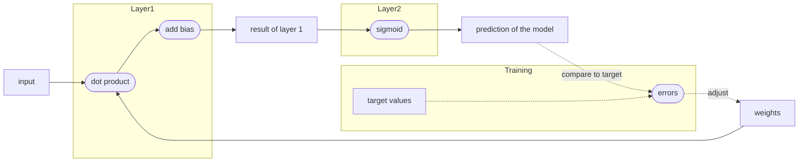
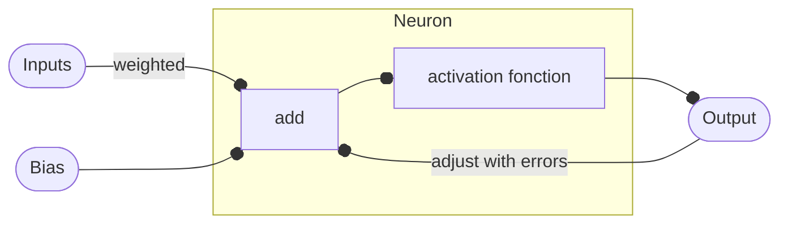

# Simple implementation from scratch of a neural network

> [Python AI NN](https://realpython.com/python-ai-neural-network/)

Use of vectors to create de model:

```python
input_vector = np.array([1.66, 1.56])
weights_1 = np.array([1.45, -0.66])
weights_2 = [2.17, 0.32]
```
We compare those vectors to the input to know wich one is more similar to the input. For that we do $weightVector \times inputVector = \sum_{i=0}^{N} x_i \times y_i$. The higher the value of the dot product, the better.

```python
dot_product_2 = np.dot(input_vector, weights_2)
# = 4.1259, higher than the other one
```

To it, we can add a constant, a bias to have a better `layer 1` model.

Now we'll add a layer 2 with the Sigmoid fonction $S(x) = \frac{1}{1-e^{-x}}$, in order to split the values between 1 and 0, meaning the weight vector is good or no, so we can classify them.

Our model will be like :



If we estimate `weights_1` is a good model vector :

```python
input_vector = np.array([1.66, 1.56])
weights_1 = np.array([1.45, -0.66])
bias = np.array([0.0])

def sigmoid(x):
    return 1 / (1 + np.exp(-x))

def make_prediction(input_vector, weights, bias):
     layer_1 = np.dot(input_vector, weights) + bias
     layer_2 = sigmoid(layer_1)
     return layer_2 > 0.5
```

But changing the input to make a new prediction, to `input_vector = np.array([2, 1.5])` wich is meant to return `False`, we get here `True`...
We're in the training part for the model.

To train the model we can use **Gradient Descent** or **Backpropagation** algorithms. 

*Gradient descent* : we substract or add (depends on its direction) the derivative $2x$ of $(prediction - target)^2$ (wich is the error of the model) to the weight.
Then we update the weight :
```python
weights_1 -= 2*(prediction - target)
```

**<span style="color:red">Carefull</span>** : overfitting happens when the model only remembers the values of the training and not make real predictions.
There are techniques to avoid that, including regularization the [stochastic gradient descent](https://realpython.com/gradient-descent-algorithm-python/#stochastic-gradient-descent-algorithms).

There changing the weight vector that abruptly makes good prediction on this input but gets wrong on the first one.
So in order to keep a bit more of the previous model we introduce the **learning rate** (or $\alpha$ parameter). Usually equals to $0.1$, $0.01$ or $0.001$.

Now the update would look like :
```python
weights_1 -= 2*(prediction - target) * alpha
```

## Chain rule
We want to adjust the weights and the bias vectors.
Each step of the layers need to be adjusted backwards. We've got an error at the end, and we go back to the start step by step while adjusting each function.

As a result we have a neural network :

```python
class NeuralNetwork:
    def __init__(self, learning_rate):
        self.weights = np.array([np.random.randn(), np.random.randn()])
        self.bias = np.random.randn()
        self.learning_rate = learning_rate

    def _sigmoid(self, x):
        return 1 / (1 + np.exp(-x))

    def _sigmoid_deriv(self, x):
        return self._sigmoid(x) * (1 - self._sigmoid(x))

    def predict(self, input_vector):
        layer_1 = np.dot(input_vector, self.weights) + self.bias
        layer_2 = self._sigmoid(layer_1)
        prediction = layer_2
        return prediction

    def _compute_gradients(self, input_vector, target):
        layer_1 = np.dot(input_vector, self.weights) + self.bias
        layer_2 = self._sigmoid(layer_1)
        prediction = layer_2

        derror_dprediction = 2 * (prediction - target)
        dprediction_dlayer1 = self._sigmoid_deriv(layer_1)
        dlayer1_dbias = 1
        dlayer1_dweights = (0 * self.weights) + (1 * input_vector)

        derror_dbias = (
            derror_dprediction * dprediction_dlayer1 * dlayer1_dbias
        )
        derror_dweights = (
            derror_dprediction * dprediction_dlayer1 * dlayer1_dweights
        )

        return derror_dbias, derror_dweights

    def _update_parameters(self, derror_dbias, derror_dweights):
        self.bias = self.bias - (derror_dbias * self.learning_rate)
        self.weights = self.weights - (
            derror_dweights * self.learning_rate
        )

## Main
learning_rate = 0.1

neural_network = NeuralNetwork(learning_rate)

neural_network.predict(input_vector)
```

Now it just needs to be trained !
We add a class method `train`:
```python
def train(self, input_vectors, targets, iterations):
    cumulative_errors = []
    for current_iteration in range(iterations):
        # Pick a data instance at random
        random_data_index = np.random.randint(len(input_vectors))

        input_vector = input_vectors[random_data_index]
        target = targets[random_data_index]

        # Compute the gradients and update the weights
        derror_dbias, derror_dweights = self._compute_gradients(
            input_vector, target
        )

        self._update_parameters(derror_dbias, derror_dweights)

        # Measure the cumulative error for all the instances
        if current_iteration % 100 == 0:
            cumulative_error = 0
            # Loop through all the instances to measure the error
            for data_instance_index in range(len(input_vectors)):
                data_point = input_vectors[data_instance_index]
                target = targets[data_instance_index]

                prediction = self.predict(data_point)
                error = np.square(prediction - target)

                cumulative_error = cumulative_error + error
            cumulative_errors.append(cumulative_error)

    return cumulative_errors
```

There we go, we can plot its result of course :
```python
import matplotlib.pyplot as plt

input_vectors = np.array(
    [
        [3, 1.5],
        [2, 1],
        [4, 1.5],
        [3, 4],
        [3.5, 0.5],
        [2, 0.5],
        [5.5, 1],
        [1, 1],
    ]
)

targets = np.array([0, 1, 0, 1, 0, 1, 1, 0])

learning_rate = 0.1

neural_network = NeuralNetwork(learning_rate)

training_error = neural_network.train(input_vectors, targets, 10000)

plt.plot(training_error)
plt.xlabel("Iterations")
plt.ylabel("Error for all training instances")
plt.savefig("cumulative_error.png")
```

> [NN for beginners](https://towardsdatascience.com/first-neural-network-for-beginners-explained-with-code-4cfd37e06eaf)

A **neuron** is just one calculus in a layer :

The activation fonction can be the Sigmoid, it is used to classify the results.


Simple neural network, the *Perceptron* (describes the `inclusive or`):
```py
import numpy, random, os
lr = 1 #learning rate
bias = 1 #value of bias
weights = [random.random(),random.random(),random.random()] #weights generated in a list (3 weights in total for 2 neurons and the bias)

def Perceptron(input1, input2, output) :
   outputP = input1*weights[0]+input2*weights[1]+bias*weights[2]
   if outputP > 0 : #activation function (here Heaviside)
      outputP = 1
   else :
      outputP = 0
   error = output – outputP
   weights[0] += error * input1 * lr
   weights[1] += error * input2 * lr
   weights[2] += error * bias * lr
```

Then we loop it for the train part on every possibilities :
```py
for i in range(50) :
   Perceptron(1,1,1) #True or true
   Perceptron(1,0,1) #True or false
   Perceptron(0,1,1) #False or true
   Perceptron(0,0,0) #False or false
```
To much iterations would be an over-fitting.

Then the testing phase can be asking a user to input values and what is expected as result, then compare and adjust in the NN.
