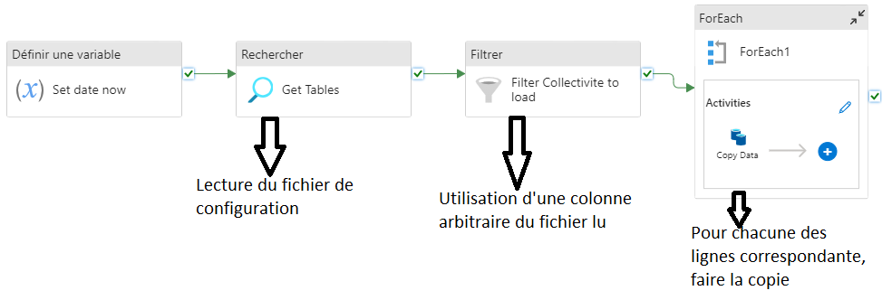

# Intégration des données de qualité

On décrit ici le processus __ETL__ du diagramme synoptique, qui permet l'intégration et la mise à maturité (~ qualité = structurer et normaliser) des données. 

Lorsqu'on veut intégrer un _dataset_ il faut commencer par définir son schéma :
- Tables de dimension : définit l'identifiant (ou les identifiants, un auto-incremental et un métier) ainsi que les attributs qui ne varie pas ou peu. Elle peut être commune à plusieurs _datasets_.
- Tables de faits : les détails d'un événement recensé dans une table. Ces colonnes sont des variables.

Avec ces définitions, on réalise la copie complète des bruts du jeu de données (_bronze_). 
Pour mener à __maturation__ (augmenter la qualité de la donnée) une donnée on va progressivement la structurer et la normaliser. Il s'agit de :
- Typer les variables, s'assurer de leur format.
- Traiter les doublons ainsi que la cohérence avec les tables de dimensions.
- Maximiser l'_accuracy_ (la donnée est juste, ou a minima plausible)
- Maximiser la _completeness_ (absence de vide, d'informations manquante mais nécessaire)
- Maximiser la _consistency_ (cohérence avec les tables de références ou entre 2 tables qui décrivent les mêmes événements).

> [Next Decision : Qu'est-ce que la Data Quality ?](https://www.next-decision.fr/wiki/qu-est-ce-que-la-data-quality)

On peut définir une pipeline générique de traitement à l'aide d'un fichier de règles tel que dans [cet exemple](https://www.youtube.com/watch?v=q7W6J-DUuJY). Ainsi un tel pipeline est entièrement paramétrable et automatisable, sans avoir à refaire une pipeline spécifique au cas par cas, peu maintenable.

> Standardisation des composants de traitement par flowlets -> https://www.youtube.com/watch?v=VWjhbDOrxAs

On crée une procedure stockée générique et paramétrisée (de façon à pouvoir l'utiliser dans des pipelines) et uniquement pour la création de table externe. On l'intègre dans une pipeline réutilisable facilement. 

Pour les _stages_ SILVER et GOLD, on ajoute avant les différents traitements définit et standardisées pour assurer la qualité des données. Certains de ces traitements vont générer des "rejets" qui devront être traités manuellement puis réinjectés dans les tables.

