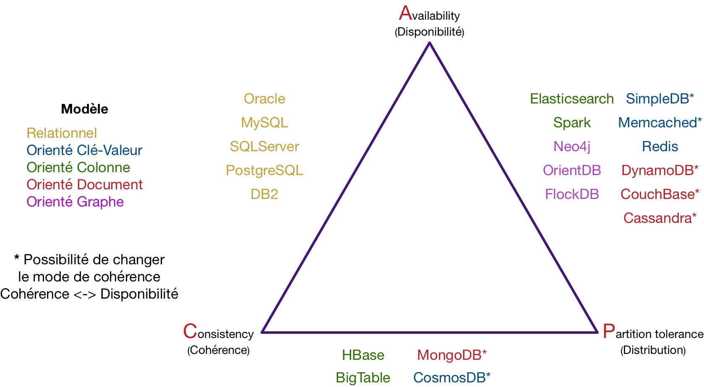

> _On cherche a comparer les BDD NoSql et les relationnelles pour en comprendre les avantages et inconvénients._

# ACID vs BASE

Les 2 systèmes de gestions des bases de données reposent chacune sur un principe fondamental, soit [ACID](https://fr.wikipedia.org/wiki/Propri%C3%A9t%C3%A9s_ACID) soit BASE.

Les systèmes de gestion de bases de données relationnelles (SGBDR) reposent sur le principe __ACID__ :

* *Atomicité* : une transaction s’effectue entièrement ou pas du tout.

* *Cohérence* : le contenu d’une base doit être cohérent au début et à la fin d’une transaction. Les tables de la bdd ne peuvent pas changer lors d'une requête.

* *Isolation* : les modifications d’une transaction ne sont visibles/modifiables que quand celle-ci a été validée. On n'affecte pas la bdd si la requête est invalide.

* *Durabilité* : une fois la transaction validée, l’état de la base est permanent (non affecté par les pannes ou autre).

Les systèmes de gestion NoSQL reposent sur le principe __BASE__, qui assouplit certaines règles pour permettre un accès plus rapide aux données :

* *Basically Available* : quelle que soit la charge de la base de données (quantité de données / requêtes), le système garantie un taux de disponibilité de la donnée.

* *Soft-state* : la base peut changer lors des mises à jour ou lors d'ajout/suppression de serveurs. La base NoSQL n'a pas à être cohérente à tout instant.

* *Eventually consistent* :  à terme, la base doit quand même être dans un état cohérent.

# Théorème CAP

Les BDD peuvent être simplifiées à 3 propriétés :

* Cohérence (_Consistency_) : une donnée, qu'importe son nombre de réplicas, doit toujours être la même (un seul état visible à la fois).

* Disponibilité (_Accuracy_) : tant que le système est en place (son serveur n'est pas éteint) la donnée doit être disponible.

* Distribution (_Partition tolerance_) : indépendamment du nombre de partitions / de serveurs, une requête doit retourner le résultat correct.

Pour formaliser les capacités cibles possibles des systèmes de gestion, on a le théorème CAP (ou théorème de Brewer) :

> Dans toute base de données, vous ne pouvez respecter au plus que 2 propriétés parmi la _cohérence_, la _disponibilité_ et la _distribution_.

Le couple CA (Consistency-Availability), représente le fait que lors d'opérations concurrentes sur une même donnée, les requêtes L1 et L2 retournent la nouvelle version (v2) et sans délai d'attente. Cette combinaison n'est possible que dans le cadre de bases de données transactionnelles telles que les SGBDR.

Le couple CP (Consistency-Partition Tolerance) propose maintenant de distribuer les données sur plusieurs serveurs en garantissant la tolérance aux pannes (réplication). En même temps, il est nécessaire de vérifier la cohérence des données en garantissant la valeur retournée malgré des mises à jour concurrentielles. La gestion de cette cohérence  nécessite un protocole de synchronisation des réplicas, introduisant des délais de latence dans les temps de réponse (L1 et L2 attendent la synchronisation pour voir v2). C'est le cas de la base NoSQL MongoDB.

Le couple AP (Availability-Partition Tolerance) à contrario s'intéresse à fournir un temps de réponse rapide tout en distribuant les données et les réplicas. De fait, les mises à jour sont asynchrones sur le réseau, et la donnée est "Eventually Consistent" (L1 voit la version v2, tandis que L2 voit la version v1). C'est le cas de Cassandra dont les temps de réponses sont appréciables, mais le résultat n'est pas garanti à 100% lorsque le nombre de mises à jour simultanées devient important.

Ainsi, la cohérence des données est incompatible avec la disponibilité dans un contexte distribué comme les bases NoSQL. Tandis que les SGBDR mettent en général de coté la distribution.

Le CAP se résume en un triangle :

# [OLAP](https://learn.microsoft.com/fr-fr/azure/architecture/data-guide/relational-data/online-analytical-processing) vs [OLTP](https://learn.microsoft.com/fr-fr/azure/architecture/data-guide/relational-data/online-transaction-processing#when-to-use-this-solution)

Les OLP regroupent des solutions de traitement de données. 

|  | [OLTP](https://www.oracle.com/fr/database/oltp-definition.html) | [OLAP](https://www.oracle.com/fr/database/olap-definition.html) |
|--|--|--|
| Nom complet | OnLine Transactional Process | OnLine Analytical Process |
| SGBDD | SGBDR | SGBDNR (NoSql) |
| Utilisation | favorise la qualité de la donnée | favorise la quantité de donnée analysée |

En pratique, on peut stocker les données avec un OLTP et les utiliser pour de l'analyse (ou une _staging database_) avec de l'OLAP :

